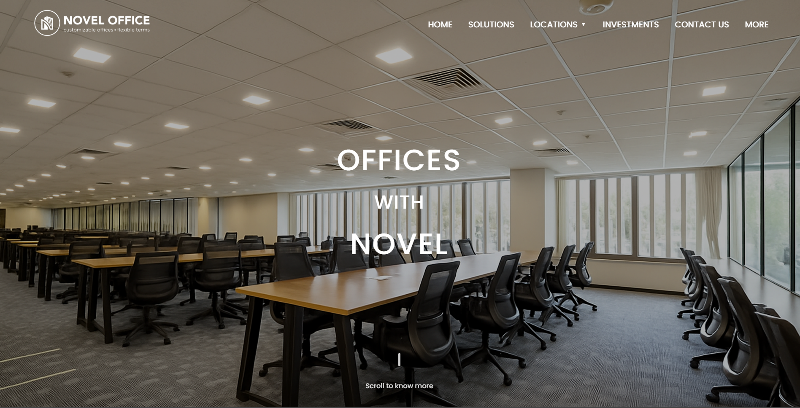
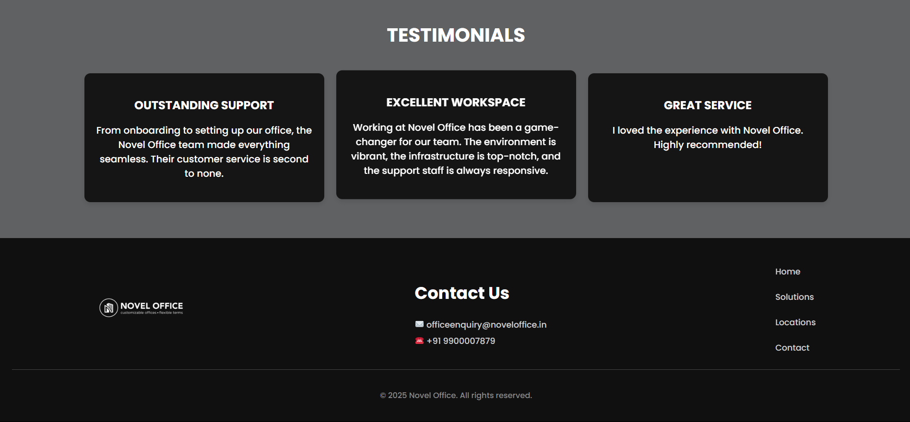

# DK Theme - Custom WordPress Theme

This is a **fully custom WordPress theme** built for the Web Developer Job Role – Round 2 Assignment. The theme replicates the provided Figma design with responsive layout, custom post types (Testimonials), and optimized performance. Developed from scratch using core WordPress functions, PHP, HTML, CSS, and JavaScript — without any page builders.

---

## 📁 Folder Structure

dk-theme/
├── assets/
│ ├── images/
│ │ ├── novel-office-b... # Background and hero section image(s)
│ │ └── novel-office-lo... # Logo used in navbar/footer
│ └── js/
│ └── script.js # JS for navbar toggle, dropdown, etc.
├── footer.php # Custom responsive footer
├── front-page.php # Homepage layout using Figma design
├── functions.php # Theme setup, enqueuing, post types
├── README.md # Documentation (this file)
└── style.css # Main stylesheet with theme metadata

---

## 🚀 Setup Instructions

1. **Install WordPress Locally Using LocalWP**
   - Download from [https://localwp.com](https://localwp.com)
   - Create a new site (e.g., `dk-assignment-site`)

2. **Copy Theme Folder**
   - Navigate to:  
     `localwp/sites/dk-assignment-site/app/public/wp-content/themes/`
   - Paste your `dk-theme` folder here.

3. **Activate Theme**
   - Go to WordPress Admin Dashboard → Appearance → Themes
   - Activate **DK Theme**

---

## ✨ Features Overview

### ✅ Custom Homepage Layout (`front-page.php`)
- Hero section with image, headline, scroll indicator
- Responsive navbar with logo, menu, dropdown
- Dynamic testimonial section pulling from a custom post type

### ✅ Responsive Footer (`footer.php`)
- Three sections: logo, contact info, links
- Column layout across all screen sizes (CSS flexbox)
- Mobile-friendly with central alignment

### ✅ Navigation Functionality
- Hamburger menu toggle for mobile
- Dropdown menu for locations
- Closes menu when clicking outside or on menu links

All JS logic is handled in `assets/js/script.js`.

---

## 🧰 WordPress Functionality

### 🔧 `functions.php` Includes:
- Enqueues CSS and JS using `wp_enqueue_style()` and `wp_enqueue_script()`
- Adds theme support features (`title-tag`, `post-thumbnails`)
- Registers `testimonial` custom post type (if added inline or via plugin)

---

## 💬 Custom Post Type: Testimonials

- Created via plugin (e.g., CPT UI) or registered manually
- Displayed in homepage using:

```php
$args = array(
    'post_type' => 'testimonial',
    'posts_per_page' => 3,
);
$query = new WP_Query($args);

Testimonials appear below the hero section and are limited to 3 recent posts

🌐 SEO & Performance Optimizations
All images use loading="lazy"

Meta tags for viewport, charset, and description included

JS loaded in the footer for performance

Minimal and clean structure for fast load

Screenshots



🧑‍💻 Developer Info
Author: Dilip Kumar K M
GitHub: https://github.com/dilipkumarkm7
Email: dilip72765@gmail.com